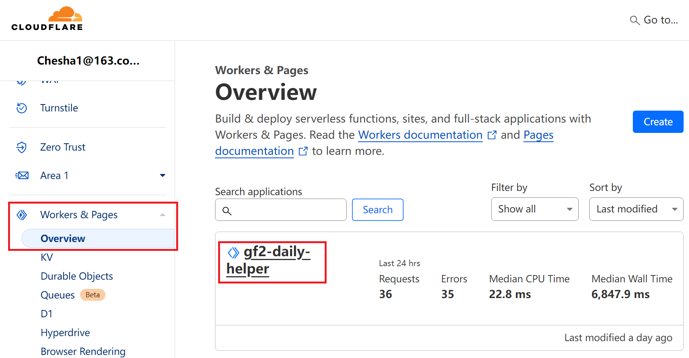
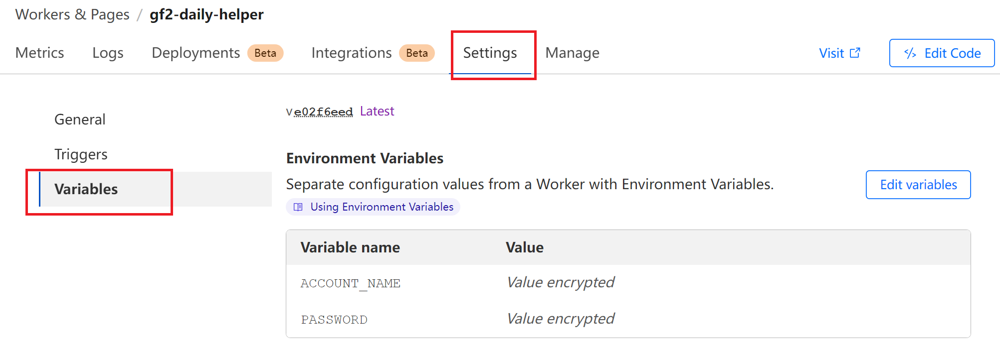

<h1>Cloudflare Worker 部署方法</h1>

> [!NOTE]  
> 并不推荐 cloudflare worker 免费用户使用 cloudflare 部署，免费计划版本的每日助手需要尽量让 CPU 时间在 10 ms 以内，满足 [Workers Free Plan 的限制](https://developers.cloudflare.com/workers/platform/pricing/#workers)，感觉不太稳定

- [如果你是 cloudflare worker 付费用户](#如果你是-cloudflare-worker-付费用户)
- [如果你是 cloudflare worker 免费用户](#如果你是-cloudflare-worker-免费用户)

# 如果你是 cloudflare worker 付费用户
本项目原生基于 Cloudflare Worker 开发，部署在 Cloudflare Worker 是最简单的

1. 首先需要一个 cloudflare 账号
2. `git clone` 本项目，在项目目录下 `npm i wrangler` 安装依赖
3. `npx wrangler deploy`，会弹出一个页面要求授权，完成操作之后就完成了 cloudflare worker 的部署
4. 登录到 [cloudlfare 控制台](https://dash.cloudflare.com/)，选择刚才部署的 worker，如下图
   
5. 添加两个环境变量 `ACCOUNT_NAME` 和 `PASSWORD`，填写自己的散爆账号和密码，完成后效果如下图
   
6. 现在，在每天的 UTC 时间 21:05（北京时间 05:05），就会执行每日任务

如果需要修改执行时间，可以到 [wrangler.toml](../wrangler.toml) 中修改 cron 表达式

# 如果你是 cloudflare worker 免费用户
一个简单的方法是：不等返回了，拿到 jwtToken 就发一堆子请求，这样每个子请求的 CPU 时间可能可以保证在 10 ms 以内

但经过一番研究，发现并不可行，cloudflare 不允许 worker 调用自己提供的 rpc 方法

日志里有一堆状态为 Canceled 的调用，其中一个日志的示例如下：

```json
{
  "outcome": "canceled",
  "scriptVersion": {
    "id": "13c73505-542f-431a-ac12-5ba536659677"
  },
  "scriptName": "gf2-daily-helper",
  "diagnosticsChannelEvents": [],
  "exceptions": [],
  "logs": [],
  "eventTimestamp": 1718980612053,
  "event": {
    "rpcMethod": "serviceTopicHandle"
  },
  "id": 0
}
```

内部运行机制不清楚，但是就算这样可以，也很依赖 cloudflare 内部的机制，cloudflare 不保证内部行为不变，但是付费版的行为基本上只依赖 Node.js 运行时，是很稳定的

如果把这些提供 rpc 方法的逻辑拆出来单独作为一个 worker 或许可以，但是需要部署两遍，就会很麻烦，如果用 cloudflare 变得如此麻烦，那不如去用 AWS 或者华为云了，它们也是免费的