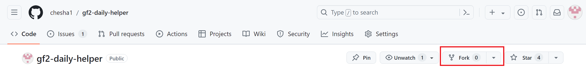
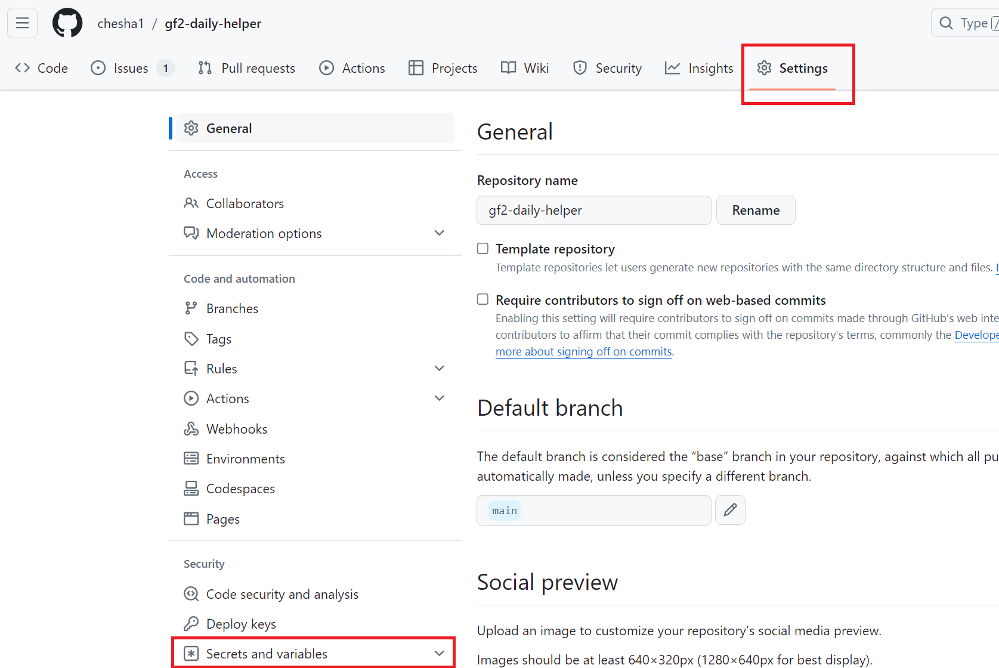
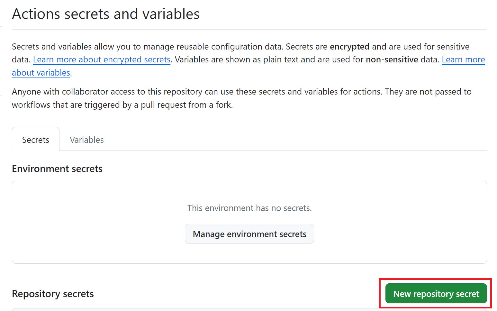
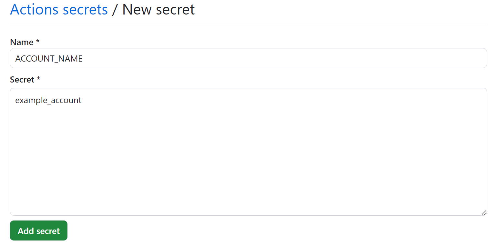
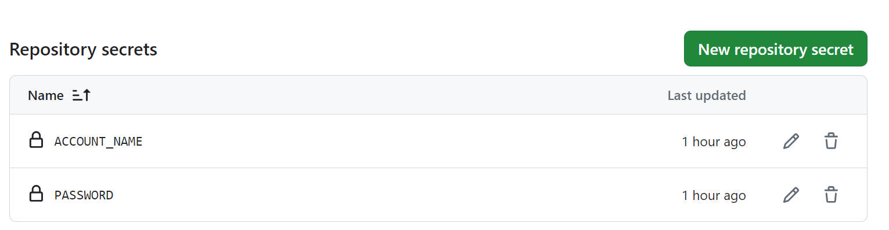
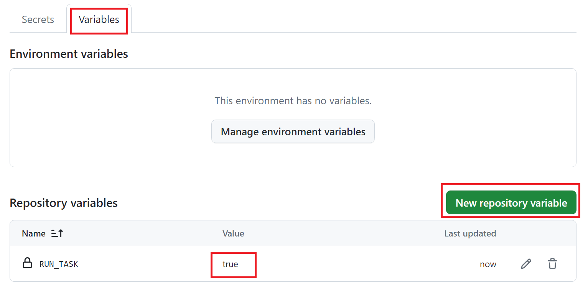
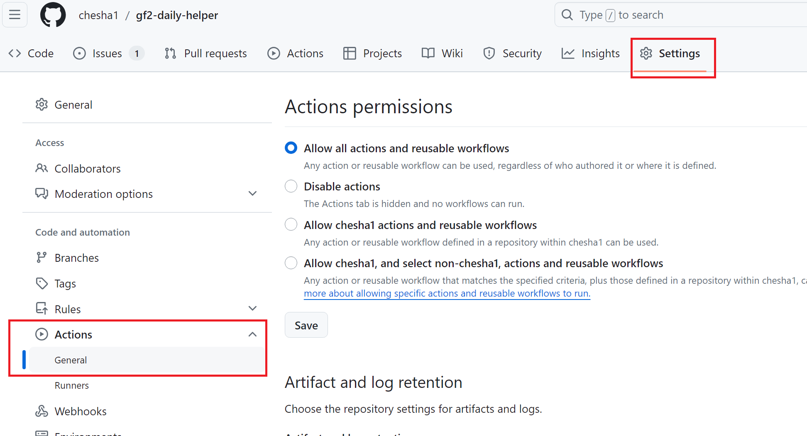
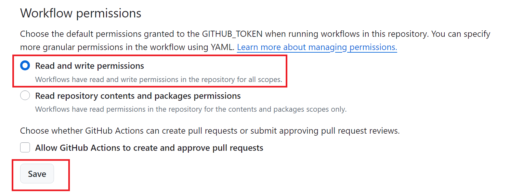

<h1>Github Actions 部署方法</h1>

- [如果你是熟练的 GitHub 使用者](#如果你是熟练的-github-使用者)
- [如果你是不太懂 GitHub 的用户](#如果你是不太懂-github-的用户)
- [其他注意事项](#其他注意事项)

## 如果你是熟练的 GitHub 使用者
部署步骤：
1. Fork 本仓库
2. 添加两个仓库 secrets `ACCOUNT_NAME` 和 `PASSWORD`，填写自己的散爆账号和密码
3. 添加仓库 variables `RUN_TASK`，并将值设置为 true
4. 在 Settings-Actions-General 中，修改 Workflow permissions 为 Read and write permissions

这样在北京时间，每天的早上 2 点 5 分，就会触发任务了
## 如果你是不太懂 GitHub 的用户
1. Fork 本仓库，如下图
   
2. 在 fork 出来的自己的仓库中，进入环境变量设置界面，如下图
   
3. 选择 Secrets and variables - Actions
4. 添加 Repository secrets，如下图
   
5. 添加两个 Repository secrets `ACCOUNT_NAME` 和 `PASSWORD`，Secret 的内容填写自己的散爆账号和密码，如下图
   
6. 添加好后效果如下图
   
7. 添加 Repository variables `RUN_TASK`，值为 `true`，添加好后效果如下图
   
8. 到设置中修改 Actions 的权限，如下图
   
9. 在当前页面中往下滑，找到 Workflow permissions，修改为 Read and write permissions，如下图
   
   

## 其他注意事项
如果需要修改执行的时间，请到 [workflow 文件](../.github/workflows/schedule.yaml) 中修改 cron 表达式的时间  

GitHub Actions 的定时任务并不会准时运行，一般需要排队一会儿，有的人甚至反映需要排队几个小时

如果不想这个任务继续运行，把 `RUN_TASK` 值从 `true` 改为其他任意值即可

GitHub 官方说，如果仓库 60 天没有活动，会暂停所有 workflows，所以我引入了[一个 workflow ](https://github.com/marketplace/actions/keepalive-workflow)来保活，暂时无法测试是否有效果

